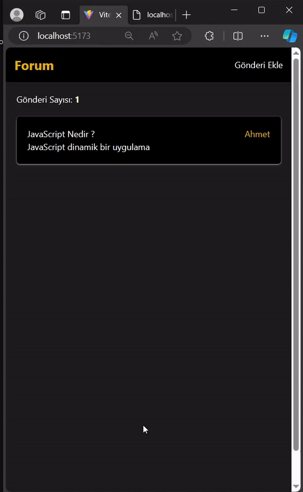

# React MVC ile Gönderi Oluşturma ve Okuma Listesi Projesi

Bu proje, React ile oluşturulmuş bir MVC (Model-View-Controller) projesidir. Temel olarak, kullanıcıların gönderiler oluşturmasına ve bu gönderileri okumasına olanak tanır. Ayrıca, bu projede toastify, axios, react-router-dom, json-server ve tailwind gibi çeşitli teknolojiler kullanılmıştır.

## Özellikler

- **Gönderi Oluşturma:** Kullanıcılar gönderi oluşturabilirler. Oluşturulan gönderilerin başlık, içerik gibi temel bilgileri bulunmaktadır.
- **Gönderi Okuma:** Kullanıcılar oluşturulan gönderileri listeleyebilir ve görebilirler.
- **React Router DOM:** Sayfalar arası gezinme için React Router DOM kullanılmıştır.
- **Toastify:** Kullanıcı etkileşimlerini bildirimlerle kullanıcıya bildirmek için toastify entegre edilmiştir.
- **Axios:** Sunucu ile HTTP istekleri yapmak için Axios kütüphanesi kullanılmıştır.
- **JSON Server:** Basit bir JSON veritabanı sunucusu olarak JSON Server kullanılmıştır.
- **Tailwind CSS:** Hızlı ve özelleştirilebilir UI oluşturmak için Tailwind CSS kullanılmıştır.

## Ekran Görüntüsü:

